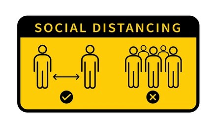
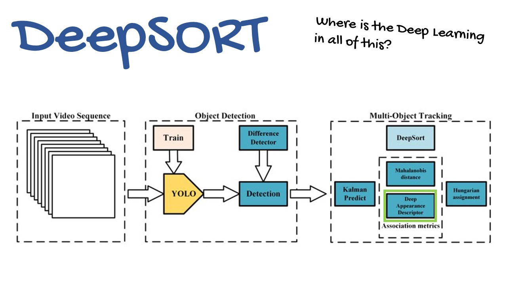
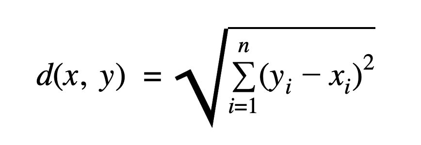
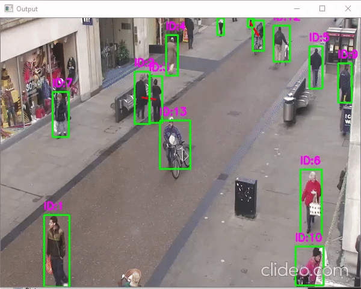
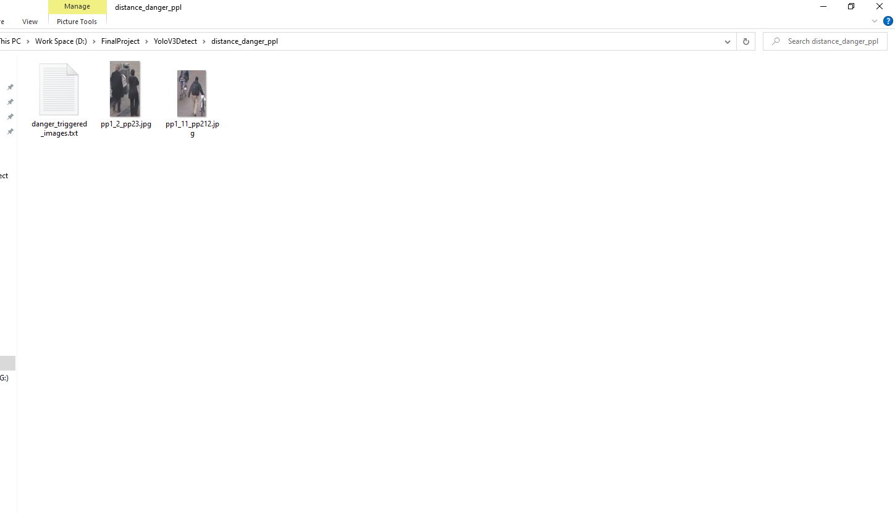
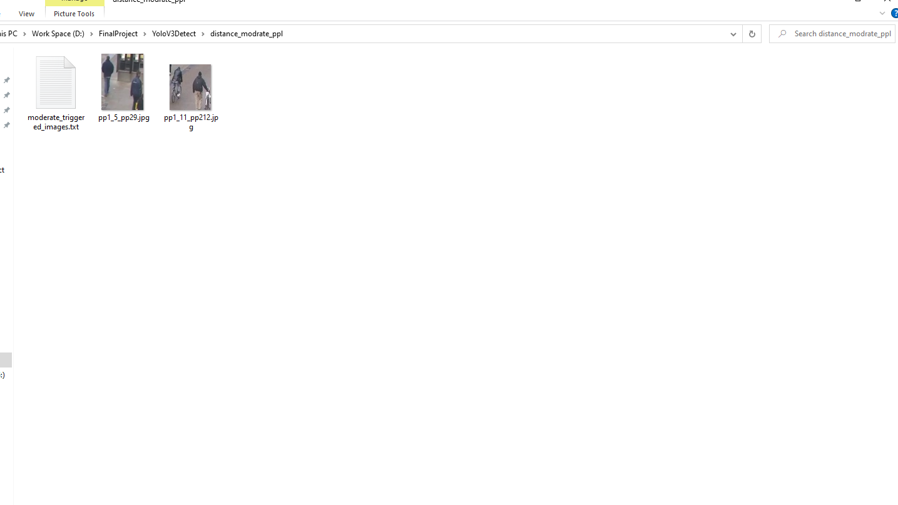

# Analysis Social Distancing Using Python



> Where There Is Python There Is A Way 😜

---

### Table of Contents
<!-- You're sections headers will be used to reference location of destination. -->

- [Description](#description)
- [How To Use](#how-to-use)
- [References](#references)
- [License](#license)
- [Author Info](#author-info)

---

## Description

The purpose of this project is, with the help of video analytics, check whether the people are maintaining social distancing or not as it is a vital part of avoiding spread of any contagious virus.

<font size="4"> **Some Information about YOLO**</font>

YOLO is an abbreviation for the term ‘You Only Look Once’. This is an algorithm that detects and recognizes various objects in a picture (in real-time). Object detection in YOLO is done as a regression problem and provides the class probabilities of the detected images.

**Why the YOLO algorithm is important**

YOLO algorithm is important because of the following reasons:

- **Speed**: This algorithm improves the speed of detection because it can predict objects in real-time.
- **High accuracy**: YOLO is a predictive technique that provides accurate results with minimal background errors.
- **Learning capabilities**: The algorithm has excellent learning capabilities that enable it to learn the representations of objects and apply them in object detection.

<font size="4"> **Deep SORT Tracking**</font>

The most popular and one of the most widely used, elegant object tracking framework is Deep SORT, an extension to SORT (Simple Real time Tracker).



<font size="4"> **Euclidean Distance**</font>

 The Euclidean distance between two points in Euclidean space is the length of a line segment between the two points. It can be calculated from the Cartesian coordinates of the points using the Pythagorean theorem, therefore occasionally being called the Pythagorean distance.

 

#### **Technologies**

- Python
- OpenCV
- DeepSORT
- YoloV3

#### **Project Flow**
1. Video frame is passed to the YoloV3 model which returns with the bounding boxs.
2. Centroid is calculated for the bounding box.
3. Euclidean Distance is calculated with all the bounding boxs and determine distance between them.


[Back To The Top](#read-me-template)

---

## How To Use

#### Installation


```html
    > git clone https://github.com/ReTrO19/Social-Distancing-Using-Python.git
    > cd Social-Distancing-Using-Python
    > py -m venv sd_venv
    > sd_venv\Scripts\activate
    > pip install -r requirements.txt
```


#### Running Code


```html
    > LaunchApp.bat
```





[Back To The Top](#read-me-template)

---

## References

You only look once (YOLO) is a state-of-the-art, real-time object detection system.
[YOLO: Real-Time Object Detection](https://pjreddie.com/darknet/yolo/)

 Simple Online and Realtime Tracking with a Deep Association Metric (Deep SORT)is an extention to SORT algorithm to integrate appearance information based on a deep appearance descriptor.[Deep SORT](https://github.com/nwojke/deep_sort)


[Back To The Top](#read-me-template)

---

## License

MIT License

Copyright (c) [2021] [Abhishek Khamkar]

Permission is hereby granted, free of charge, to any person obtaining a copy
of this software and associated documentation files (the "Software"), to deal
in the Software without restriction, including without limitation the rights
to use, copy, modify, merge, publish, distribute, sublicense, and/or sell
copies of the Software, and to permit persons to whom the Software is
furnished to do so, subject to the following conditions:

The above copyright notice and this permission notice shall be included in all
copies or substantial portions of the Software.

THE SOFTWARE IS PROVIDED "AS IS", WITHOUT WARRANTY OF ANY KIND, EXPRESS OR
IMPLIED, INCLUDING BUT NOT LIMITED TO THE WARRANTIES OF MERCHANTABILITY,
FITNESS FOR A PARTICULAR PURPOSE AND NONINFRINGEMENT. IN NO EVENT SHALL THE
AUTHORS OR COPYRIGHT HOLDERS BE LIABLE FOR ANY CLAIM, DAMAGES OR OTHER
LIABILITY, WHETHER IN AN ACTION OF CONTRACT, TORT OR OTHERWISE, ARISING FROM,
OUT OF OR IN CONNECTION WITH THE SOFTWARE OR THE USE OR OTHER DEALINGS IN THE
SOFTWARE.

[Back To The Top](#read-me-template)

---

## Author Info

- LinkedIn - [Abhishek Khamkar](https://www.linkedin.com/in/abhishek-khamkar-b30756185)


[Back To The Top](#read-me-template)
